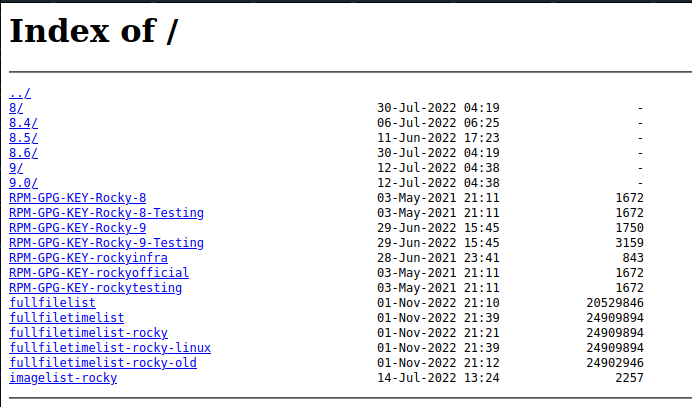
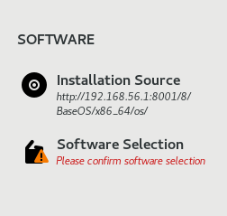
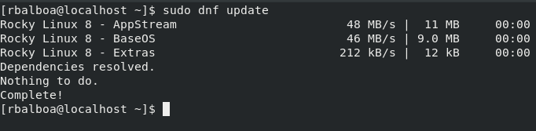
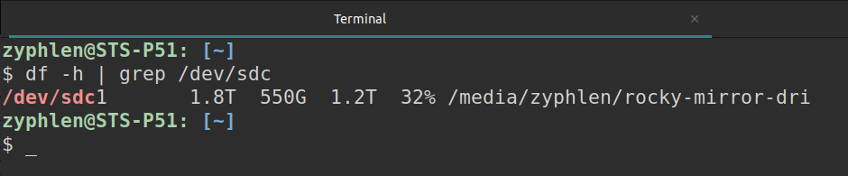

# Rocky Linux Mirror

## What I've Done:
1. Found a script in the official Rocky Linux documentation to rsync the repository -- https://docs.rockylinux.org/gemstones/setup_local_repo/
2. Modified the script to reflect the proper paths within the container
3. Bind mounted the necessary directories within the docker to local folders
	- `/etc/nginx/conf.d/` for nginx conf files
	- `/usr/share/nginx/html/rocky-linux` to be the web server root location
	- `/opt/scripts/excludes.txt` which is used by the rsync script to exclude files or directories
4. Added autoindexing to default.conf & changed the root of / to `/usr/share/nginx/html/rocky-linux`
5. Built the NGINX docker image using the nginx:latest image, copying the rsync script to the /app directory
6. Used `docker compose up -d` to bring up the container in detached mode
7. Executed the rsync script using `docker compose exec web bash rocky-sync.sh` and let the script run

8. In order to test the repository, set up a VirtualBox VM with Rocky Linux 8.6 on a custom host-only network
9. During the installation, chose the custom Installation Source `http://192.168.56.1:8001/8/BaseOS/x86_64/os/`

10. After the installation, edited the files in `/etc/yum.repos.d`
    - Commented out the mirrorlist lines
    - Added a baseurl line pointing to the correct location on `http://192.168.56.1:8001/`
        - e.g. `baseurl=http://192.168.56.1:8001/$releasever/AppStream/$basearch/os`
11. Ran `sudo dnf clean all` and `sudo dnf update` to clear the repository cache and update from the local repository

## Still to do:
- Switch from nginx:latest(162MB) to nginx:alpine(23.6MB)? Size isn't vastly different but anything helps. 
- Set up a cronjob to periodically run the rsync script to make sure the repository is up to date -- some examples here: https://docs.rockylinux.org/guides/mirror_management/add_mirror_manager/
- Set this up on the network -- current size on disk is ~550GB, official Rocky Linux documentation suggests 500-600GB of storage space but that feels very tight

